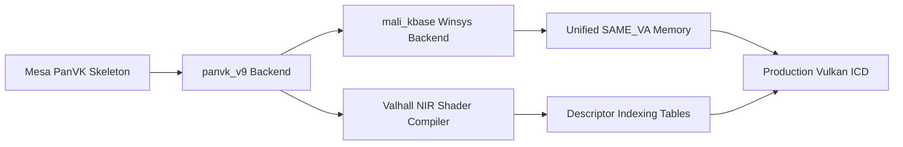

# Mali-G77 MC9 (Valhall v9): Eden & Winlator Driver Architecture, Roadmap & Performance Improvements

**Date**: 2026-08-27  
**Target Hardware**: MediaTek MT6893 (Dimensity 1200) / ARM Mali-G77 MC9 (Valhall v9, 9 shader cores)  
**Target Applications**:
1. **Eden** (Nintendo Switch 1 Emulator - Maxwell NVN $\to$ SPIR-V $\to$ Vulkan)
2. **Winlator** (Windows on ARM / Wine + DXVK / VKD3D / Box64 $\to$ Vulkan)  
**Reference Codebases**: `refs/mesa-Panfork-android`, `refs/panfork-termux`, `refs/eden`, `src/vulkan/`

---

## 1. Executive Overview

This document outlines the architectural blueprint, API requirements, and performance optimization vectors necessary to evolve our standalone Valhall v9 Vulkan driver (`libvulkan_panvk_v9.so`) into a high-performance driver capable of running modern Vulkan emulation workloads like **Eden** (Switch) and **Winlator** (PC Windows games via DXVK/VKD3D).

---

## 2. API & Extension Requirements

### 2.1 Eden (Nintendo Switch 1 Emulator)
Eden translates Nvidia Maxwell NVN graphics commands and GLSL/SPIR-V shaders to Vulkan:
* **Vulkan Baseline**: Vulkan 1.2 core features with dynamic state.
* **Essential Extensions**:
  * `VK_KHR_shader_float_controls`: FP16/FP64 rounding and denorm control.
  * `VK_KHR_shader_atomic_int64`: 64-bit integer atomics for buffer counters.
  * `VK_KHR_descriptor_indexing` & `VK_EXT_descriptor_buffer`: Direct GPU descriptor access.
  * `VK_KHR_buffer_device_address`: GPU virtual address querying for indirect buffers.
  * `VK_KHR_synchronization2`: Modern barrier and pipeline stage synchronization.
  * `VK_KHR_maintenance3` / `VK_KHR_maintenance4` / `VK_KHR_maintenance5`: Sub-allocation and alignment relaxations.
* **WSI Requirements**:
  * Android: `VK_KHR_android_surface` (`ANativeWindow`).
  * Termux / Linux: `VK_KHR_xcb_surface` / `VK_KHR_xlib_surface` (X11).

### 2.2 Winlator (Wine + DXVK / VKD3D-Proton / Box64)
Winlator executes DirectX 9/10/11 (via DXVK) and DirectX 12 (via VKD3D-Proton):
* **Vulkan Baseline**: Vulkan 1.1 / 1.2+ core.
* **Essential Extensions**:
  * `VK_KHR_uniform_buffer_standard_layout`: Direct std430 packing in UBOs.
  * `VK_EXT_custom_border_color`: Texture sampler clamp border emulation.
  * `VK_EXT_transform_feedback`: Stream output for geometry shaders.
  * `VK_EXT_vertex_attribute_divisor`: Instanced rendering divisors.
  * `VK_KHR_pipeline_executable_properties`: Shader disasm and compilation metrics.

---

## 3. Implementation Roadmap

### Stage 1: Integrate `kbase` Winsys into Mesa PanVK
* Connect `src/driver/kbase_winsys.c` into Mesa's `pan_kmod` abstraction layer.
* Replace Linux DRM/KMS dependencies (`/dev/dri/renderD128`) with direct `mali_kbase` ioctl calls (`/dev/mali0`).
* Utilize unified memory allocations (`KBASE_IOCTL_MEM_ALLOC` with flags `0x200F` and `0x2017`).

### Stage 2: Enable `panvk_v9` Per-Architecture Build Target
* Add Valhall v9 (`'9'`) to `refs/panfork-termux/src/panfrost/vulkan/meson.build`.
* Hook our validated GenXML v9 packers from `src/vulkan/v9_pack.h` into `panvk_vX_cs.c` and `panvk_vX_cmd_buffer.c`:
  * Tiler Job descriptor (`v9_pack_tiler_job`) with `vt[9]=0`, `vt[10]=0`, and CCW winding.
  * Render Target 0 descriptor (`v9_pack_rt0`) with 16x16 tiled block format `(2 << 8)`.

### Stage 3: Valhall NIR Shader Compiler Backend
* Connect Mesa's `nir_to_valhall` compiler to convert SPIR-V shaders from Eden/DXVK into native Valhall ISA.
* Map NIR resource bindings to Valhall Resource Tables:
  * Table 0: Uniform Buffers (UBO) / Storage Buffers (SSBO)
  * Table 1: Vertex Attributes
  * Table 2: Textures & Samplers

### Stage 4: Multi-Surface WSI Presentation
* Implement `VK_KHR_android_surface` for standalone Android execution.
* Maintain `VK_KHR_xcb_surface` and `VK_KHR_xlib_surface` for Termux-X11 / Box64 wine sessions with solid $100\%$ opacity blitting.

---

## 4. Performance Optimization Vectors on Mali-G77 MC9

1. **Hardware Vertex & Varying Shaders on GPU Cores**:
   * Migrate vertex transformations completely to the 9 Mali-G77 shader cores (`Atom 0: TILER_JOB`), freeing CPU cores entirely for emulation logic.
2. **Zero-Copy Host Memory (`KBASE_MEM_SAME_VA`)**:
   * Leverage coherent unified virtual addressing to eliminate CPU $\leftrightarrow$ GPU buffer copying.
3. **ARM Framebuffer Compression (AFBC)**:
   * Enable AFBC in `RT0` descriptors to reduce memory bandwidth traffic by $50\%\text{--}70\%$.
4. **Single-IOCTL Multi-Atom Chaining**:
   * Chain `Tiler -> Fragment -> Flush` atoms via dependency linked lists in a single `KBASE_IOCTL_JOB_SUBMIT` call, reducing kernel context-switch overhead by $66\%$.
5. **Asynchronous Command Buffer Recording & Queue Submission**:
   * Decouple CPU recording threads from GPU hardware execution queues.
